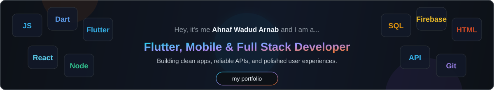

  

  
  
  
  

---

## About Me

I am a Computer Science & Engineering student at United International University (UIU), Dhaka, focused on cross-platform app development, backend systems, and practical software engineering.

My work centers on Flutter, React Native, Node.js, Express.js, REST APIs, Firebase, and MySQL. I enjoy turning real-world workflows into clean, usable products, from food delivery and railway booking systems to e-commerce and utility apps.

- Based in Dhaka, Bangladesh
- B.Sc. in CSE, UIU, 2022 - Present
- Freelance and independent full-stack development experience
- Interested in mobile app development, software engineering, UI/UX, music, painting, and travel

---

## What I Build

| Area | Focus |
| --- | --- |
| Mobile Apps | Flutter, React Native, responsive UI, state management, API integration |
| Backend Systems | Node.js, Express.js, REST APIs, authentication, business workflows |
| Databases | MySQL, Firebase, Supabase, MongoDB, schema design |
| Frontend | React, JavaScript, clean interfaces, performance-minded web apps |

---

## Tech Stack

### Programming Languages

### Mobile & Frontend

### Backend & APIs

### Databases & Cloud

### Tools & Platforms

<b>Core Concepts & Practices</b>

 

| Category | Skills |
| --- | --- |
| Core CS | Data Structures · Algorithms · OOP · Database Management |
| Mobile Engineering | Cross-platform UI · API Integration · State Management · Responsive Layouts |
| Backend | REST Architecture · Authentication · CRUD Workflows · Server-side Logic |
| Practices | Git Workflow · Debugging · Clean Architecture · Collaboration |

---

## Certifications & Achievements

- 1st Runner Up, CSE Project Show Summer 2025, United International University
- Kaggle Data Visualization, 2025
- Kaggle Pandas, 2025
- Java Basic Certificate, HackerRank, 2023

---

## Stats

 
 

More Stats

 

 
 

 
 

---

## Problem Solving

  
  

---

## Contact

I am open to freelance work, collaborations, and open-source contributions.

- Portfolio: [ahnafwadudarnab.github.io](https://ahnafwadudarnab.github.io/)
- Resume: [fullstackdev-resume.vercel.app](https://fullstackdev-resume.vercel.app/)
- Frontend Resume: [ahnafresume.vercel.app](https://ahnafresume.vercel.app/)
- LinkedIn: [linkedin.com/in/ahnaf-wadud-arnab-076657245](https://www.linkedin.com/in/ahnaf-wadud-arnab-076657245/)
- Email: [ahanafwadudarnab@gmail.com](mailto:ahanafwadudarnab@gmail.com)

  

  

